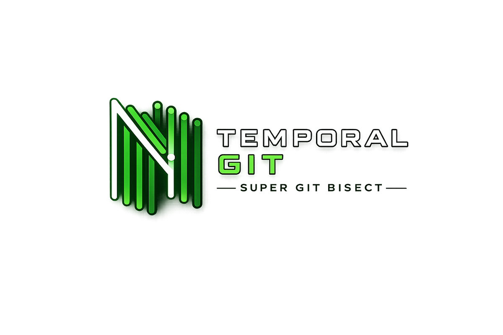

<div align="center">
  
  <br><br>
  <em>Automated git bisect. Find which commit introduced a bug with one command.</em>
  <br><br>
  <a href="https://github.com/JordanNewell/temporal-git/actions/workflows/ci.yml"></a>
  <a href="https://www.npmjs.com/package/temporal-git"></a>
  <a href="LICENSE"></a>
  <a href="https://github.com/JordanNewell/temporal-git/releases"></a>
  <a href="https://jordannewell.github.io/temporal-git/"></a>
</div>

---

You have a bug. You know it worked three months ago, and it's broken now. There are 400 commits between then and now. **Which one introduced it?**

- Without bisect: manually checking commits for hours.
- With `git bisect`: binary search finds the culprit in **log₂(400) ≈ 9 steps**.

The problem? `git bisect` has terrible CLI UX. Most developers don't even know it exists. **Temporal Git fixes that.** It wraps `git bisect` in a typed, tested engine with a clean CLI, a VS Code extension, and a programmable library — all sharing one core so behavior can't drift.

## Install

```bash
# CLI
npm install -g temporal-git

# VS Code extension
code --install-extension jordannewell.temporal-git
```

Or use the library directly:

```bash
npm install @temporal-git/core
```

## Quick Start

```bash
temporal-git run --good v1.0.0 --bad HEAD -- npm test
```

That's it. Git checks out the midpoint commit, runs `npm test`, marks it pass or fail, and repeats. When it finds the culprit:

```text
  Bisecting between v1.0.0 and HEAD

  Bisecting ████████████████░░░░░ 75% (step 3/4)

!  Found the culprit commit:

  158eca1  Fix data transformation
  Author: Jordan Newell  |  2026-07-21T00:17:22

  The old code wasn't handling edge cases properly. We need to validate
  the input shape before transforming.

  Run: git show 158eca1     Run: temporal-git reset
```

## CLI Reference

```text
Usage: temporal-git [options] [command]

Automated git bisect. Find which commit introduced a bug.

Commands:
  run [options] <command> [args...]  Run automated bisect with a test command
  start [options]                    Start an interactive bisect session
  good|g [commit]                    Mark current (or specified) commit as good
  bad|b [commit]                     Mark current (or specified) commit as bad
  skip|s [commit]                    Skip current (or specified) commit
  reset|r [commit]                   Reset the bisect session, return to original HEAD
  log                                Show the bisect session log
  status                             Show current bisect status
```

### Automated Bisect

The test command follows `--` and is passed to `git bisect run`. Args with spaces are quoted through correctly.

```bash
# npm test
temporal-git run --good v1.0.0 --bad HEAD -- npm test

# make target
temporal-git run --good v1.0.0 --bad HEAD -- make test

# any script — args with spaces get quoted through correctly
temporal-git run --good v1.0.0 --bad HEAD -- npm test --grep "user signup"

# HEAD is the default-ish bad commit; you can use any ref
temporal-git run --good abc1234 --bad feature-branch -- pytest tests/
```

Exit-code convention (per `git bisect run`): `0` = good, non-zero = bad, `125` = skip (e.g. won't build).

### Interactive Bisect

When you don't have a test command and need to verify each commit manually:

```bash
temporal-git start --good v1.0.0 --bad HEAD
```

Git checks out each midpoint commit. You test it yourself and mark it:

```text
  Bisecting between v1.0.0 and HEAD

?  Current commit:
  bc4846e  follow-up 2
  Author: Jordan Newell

  Is this commit (g)ood, (b)ad, or (s)kip? g
```

Invalid answers re-prompt instead of being silently coerced to `skip`:

```text
  Is this commit (g)ood, (b)ad, or (s)kip? x

  Error: Unknown answer "x". Use g/good, b/bad, or s/skip.
  Is this commit (g)ood, (b)ad, or (s)kip?
```

### Path-Limited Bisect

Only consider commits that touched specific paths — narrows the search space dramatically when the bug is isolated to one module:

```bash
temporal-git run --good v1.0 --bad HEAD --path src/api/ -- npm test
temporal-git run --good v1.0 --bad HEAD --path src/api/ src/auth/ -- make test
```

### Marking Commits Manually

During an interactive session you can mark from any terminal (no need to stay in the original one):

```bash
temporal-git good         # mark current HEAD as good
temporal-git good abc123  # mark a specific commit as good
temporal-git bad          # mark current HEAD as bad
temporal-git skip         # skip current commit (e.g. won't build)
temporal-git log          # show the full bisect log
temporal-git status       # is a session active?
temporal-git reset        # end the session, return to original branch
```

### Keeping Bisect Refs

By default, `run` resets the session after finding the culprit. Pass `--no-reset` to keep the bisect refs around (useful for inspecting intermediate state):

```bash
temporal-git run --good v1.0.0 --bad HEAD --no-reset -- npm test
# then later:
temporal-git log
temporal-git reset   # clean up when done
```

## Library API

`@temporal-git/core` exposes the same `BisectEngine` the CLI and VS Code extension use. Drop it into a CI job, a custom runner, or another tool.

```bash
npm install @temporal-git/core
```

### Run a bisect programmatically

```ts
import { BisectEngine } from '@temporal-git/core';

const engine = new BisectEngine(process.cwd());

const result = await engine.run({
  good: 'v1.0.0',
  bad: 'HEAD',
  command: ['npm', 'test'],
  // paths: ['src/api/'],            // optional: path-limited bisect
  // reset: false,                   // optional: keep bisect refs after run
});

console.log(result);
// {
//   commit: '158eca1...',
//   shortCommit: '158eca1',
//   author: 'Jordan Newell',
//   date: '2026-07-21T00:17:22',
//   message: 'Fix data transformation\n\nThe old code wasn\'t handling...'
// }
```

### Drive an interactive session

```ts
const engine = new BisectEngine();

await engine.start({ good: 'v1.0.0', bad: 'HEAD' });

// Each midpoint checkout — you test, then mark:
await engine.mark('good');           // or 'bad', or 'skip'
await engine.mark('bad', 'abc123');  // mark a specific commit

if (await engine.isActive()) {
  const log = await engine.log();
  console.log(log);
}

await engine.reset();                // return to original HEAD
```

### Streaming progress

`engine.run` returns a promise, but the underlying git output streams through `reduceBisectStep` if you want to render progress yourself:

```ts
import { reduceBisectStep } from '@temporal-git/core';
// reduceBisectStep(prev: BisectStepState, chunk: string) -> { step, totalEstimate }
```

### Full API surface

| Class / function | Signature |
|------------------|-----------|
| `BisectEngine` | `new BisectEngine(cwd?: string)` |
| `engine.run` | `(options: RunOptions) => Promise<BisectResult>` |
| `engine.start` | `(options: BisectOptions) => Promise<void>` |
| `engine.mark` | `(type: 'good'\|'bad'\|'skip', commit?: string) => Promise<string>` |
| `engine.reset` | `(commit?: string) => Promise<void>` |
| `engine.log` | `() => Promise<string>` |
| `engine.isActive` | `() => Promise<boolean>` |
| `engine.isInsideRepo` | `() => Promise<boolean>` |
| `engine.getCommitInfo` | `(hash: string) => Promise<BisectResult>` |
| `engine.getCurrentCommit` | `() => Promise<{ commit; shortCommit; ... }>` |
| `engine.getGitHubRemote` | `() => Promise<string \| null>` |
| `parseGitHubOwnerRepo` | `(remoteUrl: string) => string \| null` |
| `shellQuote` | `(s: string) => string` |
| `reduceBisectStep` | `(prev, chunk) => BisectStepState` |

## VS Code Extension

| Shortcut | Command |
|----------|---------|
| `Ctrl+Alt+B` / `Cmd+Alt+B` | Bisect This Bug (Automated) |
| Command Palette | Start Interactive Bisect |
| Command Palette | Mark Current Commit as Good |
| Command Palette | Mark Current Commit as Bad |
| Command Palette | Skip Current Commit |
| Command Palette | Reset Bisect Session |

> **Why `Ctrl+Alt+B` and not `Ctrl+Shift+B`?** The latter is VS Code's built-in "Run Build Task" — claiming it would break every user's build workflow. `Ctrl+Alt+B` is unbound by default.

### Automated Flow

1. `Ctrl+Alt+B` — or Command Palette → **Temporal Git: Bisect This Bug (Automated)**
2. Enter the good commit (last known working — tag, branch, or SHA)
3. Enter the bad commit (defaults to `HEAD`)
4. Enter the test command — `npm test`, `make test`, `pytest tests/`, etc. Quote args containing spaces.
5. Progress shows in the notification bar: `Step 3/6`, then `Running: npm test...`
6. Result opens in a webview panel with the culprit SHA, author, date, message body, and action buttons:
   - **View Diff** — opens `git show <sha>` in a terminal
   - **Copy Hash** — copies the short SHA to clipboard
   - **Open in GitHub** — appears only when the repo's `origin` remote resolves to GitHub

### Interactive Flow

Use **Start Interactive Bisect** when you don't have a programmatic test. After each checkout, VS Code notifies you which commit is being tested; use the palette commands (or the CLI in a sibling terminal) to mark it good/bad/skip.

## How It Works

`temporal-git` wraps `git bisect` with typed, tested plumbing:

- **Automated mode** uses `git bisect run <argv>`, which interprets exit codes (`0` = good, non-zero = bad, `125` = skip)
- **Interactive mode** walks you through `git bisect start` → mark good/bad → find culprit → reset
- **Progress** counts observed bisect steps (git's "revisions left" count can exceed the step estimate, so naïve math produces negative percentages — we don't do that)
- **Result** shows the culprit commit with full context (SHA, author, date, full message body)

## Packages

Monorepo managed with npm workspaces:

| Package | npm | What |
|---------|-----|------|
| [`packages/core`](packages/core) | `@temporal-git/core` | The `BisectEngine` — shared by both surfaces so behavior can't drift |
| [`packages/cli`](packages/cli) | `temporal-git` | The CLI |
| [`packages/vscode`](packages/vscode) | `jordannewell.temporal-git` (marketplace) | The VS Code extension |

Both the CLI and extension import `@temporal-git/core`. The engine ships with an integration test that builds a real temp git repo and verifies `BisectEngine.run` finds a known first-bad commit.

## Build

```bash
npm install
npm run build        # builds all three packages
npm test             # runs the @temporal-git/core suite (14 tests)
```

Requires Node ≥ 18.

## License

[MIT](LICENSE) © Jordan Newell


<p align="right">
  <a href="https://jordannewell.com" title="Built by Jordan Newell">
    
  </a>
</p>